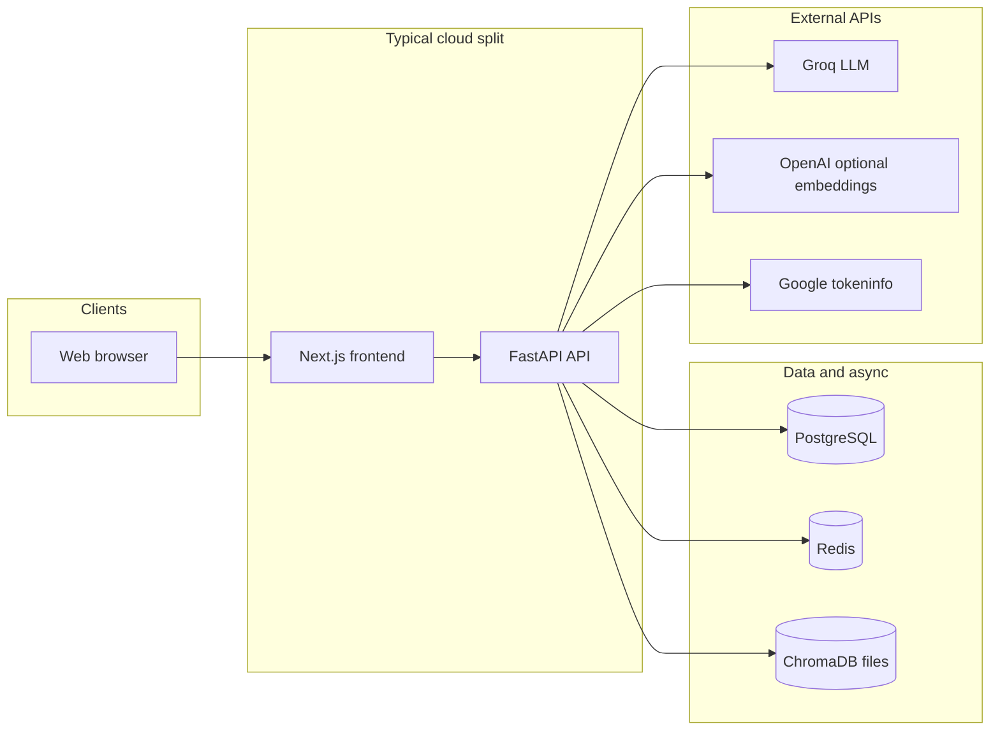

# Eastern AI Consultant — Software Solution Design (SSD)

**Document type:** Solution / software design specification  
**Scope:** Implemented features, architecture, APIs, data, and deployment as reflected in this repository  
**Audience:** Engineers, product owners, and operators  

---

## 1. Executive summary

**Eastern AI Consultant** is a full-stack AI platform oriented toward education, business consulting, agriculture, career coaching, automation, and community— with multilingual UI (English, Amharic, Afaan Oromo, Somali) and a **FastAPI** backend paired with a **Next.js 15** (App Router) frontend.

The system centers on:

- **Multi-agent conversational AI** (Groq-backed LLMs, LangChain/LangGraph orchestration, optional RAG over ChromaDB).
- **Structured domain modules** (courses, business profiles and reports, automation records, agriculture helpers, career generators, tool directory, community forum).
- **Authentication** (JWT access + refresh, optional Google ID-token login), **role-based users**, **notifications**, and **subscription-oriented payments** (Stripe-oriented API surface; verify live Stripe wiring before treating as production billing).

---

## 2. Goals and non-goals

### 2.1 Goals (as implemented)

| Goal | Realization |
|------|-------------|
| Unified AI assistant | Chat UI + `/api/v1/chat/stream` with agent selection or auto-routing |
| Domain expertise | Ten registered agents with curated system prompts (`backend/app/agents/`) |
| Learning | Course catalogue, enrollment, lesson completion and progress % |
| Business intelligence | CRUD businesses, document upload metadata, multi-step **LangGraph** business report |
| Operational templates | Automation types, templates API, user automations + toggle |
| Regional relevance | Prompts and copy emphasize Horn of Africa / low-bandwidth contexts |
| Operability | Docker Compose stack, Alembic migrations, health endpoints, structured logging |

### 2.2 Non-goals / stubs (call out explicitly)

- **Celery tasks** include stubs for full email delivery and PDF report bytes (`backend/app/workers/tasks.py`); production must wire real providers.
- **Stripe**: checkout/cancel endpoints exist; confirm webhook handling and secrets in your deployment if you need live commerce.
- **Google OAuth**: implemented as **`POST /auth/google`** validating an ID token via Google `tokeninfo`— not a full browser redirect OAuth dance unless the frontend supplies tokens accordingly.
- **PWA manifest**: not located under `frontend/` in a standard `manifest.json` glob; treat “PWA” in marketing README as aspirational unless you add assets.
- **Vercel serverless** cannot run Celery workers in-process; workers require a separate process (see `docker-compose.yml` / external host).

---

## 3. System context

---

## 4. Architecture

### 4.1 Logical layers

| Layer | Responsibility |
|-------|------------------|
| **Presentation** | Next.js App Router pages, shadcn/ui components, Zustand auth store, React Query defaults, i18n JSON |
| **API** | FastAPI routers under `/api/v1`, Pydantic schemas, dependency-injected DB sessions |
| **Domain** | SQLAlchemy models (users, learning, business, chat, community, payments, notifications, AI artifacts) |
| **AI** | Agent registry, `BaseAgent` invoke/stream, LangGraph classifier + business analysis graph, `RAGService` |
| **Async** | Celery app + Redis broker (document ingest, email stub, PDF stub) |
| **Cross-cutting** | CORS, rate limiting (slowapi), request ID + timing middleware, security headers, logging |

### 4.2 Repository layout (high level)

| Path | Role |
|------|------|
| `frontend/` | Next.js 15 + TypeScript + Tailwind + shadcn |
| `backend/` | FastAPI app, Alembic, Celery, Dockerfile |
| `infra/nginx/` | Reverse proxy configuration for combined hosting |
| `docker-compose.yml` | Postgres (pgvector image), Redis, API, worker, web, nginx |
| `docs/` | Deployment guides (`vercel.md`, `render-vercel.md`) and this SSD |

### 4.3 Frontend route map (App Router)

| Route / area | Purpose |
|--------------|---------|
| `/` | Marketing landing (hero, features, stats, agents showcase, pricing, FAQ, testimonials, CTA, footer) |
| `/auth/login`, `/auth/signup`, `/auth/forgot-password` | Authentication flows |
| `(app)/dashboard` | Authenticated home / overview |
| `(app)/chat` | Multi-agent streaming chat (agent picker, markdown, voice input via Web Speech API, TTS hook in UI, attachments control) |
| `(app)/academy`, `(app)/academy/[slug]` | Course listing and course detail |
| `(app)/business` | Business module UI |
| `(app)/agriculture` | Agriculture module UI |
| `(app)/automation` | Automation center UI |
| `(app)/career` | Career coach UI |
| `(app)/community` | Community forum UI |
| `(app)/tools` | AI tools directory UI |
| `(app)/admin` | Admin analytics (lazy charts) |
| `(app)/settings` | User settings |

Global: theme toggle, language switcher, dashboard layout (sidebar, mobile sheet nav, header, auth guard).

### 4.4 Backend router map

All business routes are mounted under **`/api/v1`** (see `backend/app/core/config.py` → `API_V1_PREFIX`).

| Tag | Prefix | Module file |
|-----|--------|-------------|
| health | `/health` | `endpoints/health.py` |
| auth | `/auth` | `endpoints/auth.py` |
| users | `/users` | `endpoints/users.py` |
| chat | `/chat` | `endpoints/chat.py` |
| courses | `/courses` | `endpoints/courses.py` |
| business | `/business` | `endpoints/business.py` |
| automation | `/automation` | `endpoints/automation.py` |
| agriculture | `/agriculture` | `endpoints/agriculture.py` |
| career | `/career` | `endpoints/career.py` |
| community | `/community` | `endpoints/community.py` |
| tools | `/tools` | `endpoints/tools.py` |
| notifications | `/notifications` | `endpoints/notifications.py` |
| payments | `/payments` | `endpoints/payments.py` |
| admin | `/admin` | `endpoints/admin.py` |

Root app also serves `GET /` metadata and OpenAPI at `/docs`, `/redoc`, `/openapi.json`.

---

## 5. Feature catalog (exhaustive by subsystem)

### 5.1 Platform and cross-cutting

- **OpenAPI documentation** (`/docs`, `/redoc`).
- **CORS** configurable via `CORS_ORIGINS` (comma-separated; trailing slashes normalized in settings).
- **Rate limiting** per remote address (slowapi; default from `RATE_LIMIT_PER_MINUTE`).
- **Request context**: `X-Request-ID` echo/generation, `X-Response-Time-ms`, structured request logging.
- **Security headers**: `X-Content-Type-Options`, `X-Frame-Options`, `Referrer-Policy`, `Permissions-Policy`.
- **Validation errors**: unified JSON shape for `422` responses.
- **File storage abstraction**: `local` | `s3` | `cloudinary` (`backend/app/services/storage.py`).

### 5.2 Identity, access, and users

**Roles (`UserRole`):** `student`, `business_owner`, `teacher`, `consultant`, `admin`.

**Auth endpoints:**

| Method | Path | Feature |
|--------|------|---------|
| POST | `/api/v1/auth/register` | Email/password registration; returns tokens + user |
| POST | `/api/v1/auth/login` | JSON login |
| POST | `/api/v1/auth/login/form` | OAuth2 password form (Swagger compatibility); `include_in_schema=False` |
| POST | `/api/v1/auth/refresh` | Refresh access token |
| POST | `/api/v1/auth/logout` | Invalidate refresh session |
| GET | `/api/v1/auth/me` | Current user profile |
| POST | `/api/v1/auth/password/forgot` | Password reset request (flow depends on email wiring) |
| POST | `/api/v1/auth/password/reset` | Confirm reset with token |
| POST | `/api/v1/auth/verify-email/{token}` | Email verification |
| POST | `/api/v1/auth/google` | Google ID token → user + tokens (tokeninfo validation) |

**User profile:**

| Method | Path | Feature |
|--------|------|---------|
| GET | `/api/v1/users/me` | Profile read |
| PATCH | `/api/v1/users/me` | Profile update |

**Persistence:** `User`, `OAuthAccount`, `UserSession` (hashed refresh tokens).

### 5.3 AI chat and agents

**Registered agents (`AgentType` → persona):**

1. `teacher` — AI Teacher  
2. `business_consultant` — Business Consultant (uses optional business context)  
3. `agriculture` — Agriculture Advisor  
4. `marketing` — Marketing Assistant  
5. `career_coach` — Career Coach  
6. `automation` — Automation Expert  
7. `resume_builder` — Resume Builder  
8. `translator` — EN/AM/OM/SO translator behavior  
9. `student_tutor` — Student Tutor  
10. `startup_advisor` — Startup Advisor  

**LangGraph — chat routing (`backend/app/langgraph/chat_router.py`):**

- **Classify** user message with a fast model (or honor `forced_agent`).
- **Answer** node invokes the selected agent (non-streaming path for tests/jobs).
- Streaming path in the HTTP layer uses **classifier + agent stream** for lower latency (documented in module).

**RAG (`backend/app/services/rag.py`):**

- Chroma persistent store under `VECTOR_STORE_PATH`.
- Embeddings: OpenAI `text-embedding-3-small` if key present; else optional HuggingFace; else Chroma default ONNX.
- Text splitting and **ingest** helpers used from chat and document flows.

**Chat HTTP API:**

| Method | Path | Feature |
|--------|------|---------|
| GET | `/api/v1/chat/agents` | Public catalogue: key, name, short description |
| GET | `/api/v1/chat/conversations` | List user conversations (archive filter, limit) |
| POST | `/api/v1/chat/conversations` | Create conversation (title, agent, language) |
| GET | `/api/v1/chat/conversations/{id}` | Conversation + ordered messages |
| DELETE | `/api/v1/chat/conversations/{id}` | Delete conversation |
| POST | `/api/v1/chat/stream` | **SSE/streaming** assistant response; persists user + assistant messages; optional RAG retrieval |
| GET | `/api/v1/chat/stats` | Usage stats for dashboard |

**Frontend chat UX (non-exhaustive UI):**

- Agent picker (including mobile-friendly patterns).
- Markdown rendering with lazy-loaded syntax highlighter.
- Web Speech API microphone input.
- UI affordances for TTS / attachments (verify backend support for uploads in stream if extending).

### 5.4 Learning (AI Academy)

**Data model capabilities:** `Course`, `Lesson`, `Enrollment`, `LessonProgress`, `Quiz`, `QuizAttempt`, `Certificate` (ORM supports richer learning; **HTTP API** focuses on catalogue + progress below).

**Courses API:**

| Method | Path | Feature |
|--------|------|---------|
| GET | `/api/v1/courses` | Paginated published courses; filters: category, level, language, free, search |
| GET | `/api/v1/courses/{slug}` | Course detail + ordered lessons |
| POST | `/api/v1/courses/{slug}/enroll` | Idempotent enroll |
| GET | `/api/v1/courses/me/enrollments` | My enrollments |
| POST | `/api/v1/courses/lessons/{lesson_id}/complete` | Mark lesson done; recompute enrollment `%`; set `completed_at` at 100% |

**Frontend:** academy list and `[slug]` lesson/course experience.

### 5.5 Business consulting

**Capabilities:**

- Multiple **business profiles** per user.
- **Documents** linked to a business (upload pipeline hooks into Celery ingest for RAG— see worker task).
- **AI business report** via LangGraph **multi-step** workflow (`backend/app/langgraph/business_analysis.py`): Diagnose → SWOT → Automation roadmap → 30-day marketing → Synthesize JSON report.
- Persisted **AI reports** model (`AIReport`) used with listing endpoint.

**Business API:**

| Method | Path | Feature |
|--------|------|---------|
| GET | `/api/v1/business` | List my businesses |
| POST | `/api/v1/business` | Create business |
| GET | `/api/v1/business/{id}` | Read |
| PATCH | `/api/v1/business/{id}` | Update |
| POST | `/api/v1/business/{id}/documents` | Attach document (storage + async ingest) |
| POST | `/api/v1/business/analyze` | Run LangGraph analysis (request includes business payload / IDs per implementation) |
| GET | `/api/v1/business/{id}/reports` | List analysis reports |

### 5.6 Automation center

**Automation types (enum):** WhatsApp, email, invoice, social, chatbot, appointment, lead, CRM.

**API:**

| Method | Path | Feature |
|--------|------|---------|
| GET | `/api/v1/automation/templates` | List starter templates |
| POST | `/api/v1/automation/templates/generate` | Generate / instantiate from template |
| GET | `/api/v1/automation` | List user automations |
| POST | `/api/v1/automation` | Create automation |
| POST | `/api/v1/automation/{id}/toggle` | Toggle active/paused etc. |

### 5.7 Agriculture

| Method | Path | Feature |
|--------|------|---------|
| POST | `/api/v1/agriculture/crop-recommendation` | LLM-backed recommendation |
| POST | `/api/v1/agriculture/pest-diagnosis` | Symptom/diagnosis style assist |
| POST | `/api/v1/agriculture/weather` | Advisory text given weather inputs |
| GET | `/api/v1/agriculture/market-prices` | Structured / stub market data (verify live data sources) |

### 5.8 Career coach

| Method | Path | Feature |
|--------|------|---------|
| POST | `/api/v1/career/resume` | Resume generation assist |
| POST | `/api/v1/career/cover-letter` | Cover letter |
| POST | `/api/v1/career/interview-sim` | Interview simulation |
| POST | `/api/v1/career/skill-assessment` | Skill assessment |

### 5.9 Community

**Models:** `ForumPost`, `Comment`, `Reaction`.

| Method | Path | Feature |
|--------|------|---------|
| GET | `/api/v1/community/posts` | Paginated posts |
| POST | `/api/v1/community/posts` | Create post |
| GET | `/api/v1/community/posts/{slug}` | Post by slug |
| GET | `/api/v1/community/posts/{slug}/comments` | Comments thread |
| POST | `/api/v1/community/posts/{slug}/comments` | Add comment |
| POST | `/api/v1/community/posts/{slug}/react` | Reaction toggle / add |

### 5.10 AI tools directory

- **Curated in-memory catalogue** (`TOOLS` in `endpoints/tools.py`): ChatGPT, Claude, Perplexity, Midjourney, Canva, ElevenLabs, GitHub Copilot, and additional entries (~12+ tools).
- **Endpoints:**

| Method | Path | Feature |
|--------|------|---------|
| GET | `/api/v1/tools` | List with optional filters |
| GET | `/api/v1/tools/{slug}` | Detail |
| GET | `/api/v1/tools/categories/list` | Category facet |

### 5.11 Notifications

| Method | Path | Feature |
|--------|------|---------|
| GET | `/api/v1/notifications` | List notifications |
| GET | `/api/v1/notifications/unread-count` | Badge count |
| POST | `/api/v1/notifications/{id}/read` | Mark one read |
| POST | `/api/v1/notifications/read-all` | Mark all read |

### 5.12 Payments and subscriptions

**Plans:** Static `FREE`, `PRO`, `ENTERPRISE` descriptors with marketing feature bullets.

| Method | Path | Feature |
|--------|------|---------|
| GET | `/api/v1/payments/plans` | List plans |
| GET | `/api/v1/payments/subscription` | Current user subscription snapshot |
| POST | `/api/v1/payments/checkout` | Start checkout (Stripe-oriented) |
| POST | `/api/v1/payments/cancel` | Cancel subscription |

**Models:** `Subscription`, `Payment`.

### 5.13 Admin

| Method | Path | Feature |
|--------|------|---------|
| GET | `/api/v1/admin/stats` | Aggregate stats |
| GET | `/api/v1/admin/users` | Paginated users |
| PATCH | `/api/v1/admin/users/{id}/role` | Role change |
| POST | `/api/v1/admin/users/{id}/disable` | Disable user |
| GET | `/api/v1/admin/courses` | Course moderation listing |

Access control is enforced via dependencies (`CurrentUser`, role checks— confirm `admin` gating in `deps.py` when hardening).

### 5.14 Health

| Method | Path | Feature |
|--------|------|---------|
| GET | `/api/v1/health/health` | Structured health payload |
| GET | `/api/v1/health/ping` | Liveness |

### 5.15 Background workers (Celery)

**Tasks:**

| Task name | Purpose |
|-----------|---------|
| `ingest_document` | Extract text from file → RAG ingest |
| `send_email` | **Stub** — logs only |
| `generate_pdf_report` | **Stub** — writes minimal placeholder PDF bytes |

**Broker:** Redis (`REDIS_URL`).

---

## 6. Data model summary

Entities registered for Alembic / ORM (from `backend/app/models/__init__.py`):

| Entity | Typical use |
|--------|-------------|
| `User`, `OAuthAccount`, `UserSession` | Auth and sessions |
| `Course`, `Lesson`, `Enrollment`, `LessonProgress`, `Quiz`, `QuizAttempt`, `Certificate` | Learning |
| `Business`, `BusinessDocument` | Business consulting + uploads |
| `AIReport`, `Automation`, `AutomationRun` | Reports and automations |
| `Conversation`, `Message` | Chat history |
| `ForumPost`, `Comment`, `Reaction` | Community |
| `Notification` | In-app notifications |
| `Subscription`, `Payment` | Billing |

---

## 7. Internationalization (frontend)

- Supported locales align with `Language` enum: **en, am, om, so**.
- Translation strings maintained under `frontend/src/lib/i18n/translations.ts` (or related hooks `use-translation`).

---

## 8. Security considerations (design-level)

- **JWT** access tokens embed user id and role claims; refresh tokens stored hashed in `UserSession`.
- **Password hashing** via security helpers in `backend/app/core/security.py`.
- **HTTPS** assumed in production; frontend must use `NEXT_PUBLIC_API_URL` with `https` to avoid mixed content.
- **Secrets** must never be committed; use `.env` / host secret managers.
- **Permissions-Policy** restricts camera; microphone allowed for self for voice features— align with actual product need.

---

## 9. Deployment and operations

| Concern | Reference |
|---------|-----------|
| Full Docker stack | `docker-compose.yml` |
| Dual Vercel (frontend + API) | `docs/vercel.md` |
| Render + Vercel split | `docs/render-vercel.md`, `render.yaml` (repo root) |
| DB migrations | Alembic in `backend/alembic/` |
| Seed script | `backend/scripts/seed.py` |

**Environment variables:** see `backend/.env.example`, `frontend/.env.example`, and deployment docs.

---

## 10. Traceability matrix (features → primary code)

| Feature area | Backend | Frontend |
|--------------|---------|----------|
| Auth | `endpoints/auth.py`, `core/security.py` | `app/auth/*`, `store/auth.ts`, `lib/api.ts` |
| Chat + agents | `endpoints/chat.py`, `agents/*`, `langgraph/chat_router.py` | `(app)/chat/*`, `components/chat/*` |
| Courses | `endpoints/courses.py`, `models/learning.py` | `(app)/academy/*` |
| Business | `endpoints/business.py`, `langgraph/business_analysis.py` | `(app)/business/*` |
| Automation | `endpoints/automation.py` | `(app)/automation/*` |
| Agriculture | `endpoints/agriculture.py` | `(app)/agriculture/*` |
| Career | `endpoints/career.py` | `(app)/career/*` |
| Community | `endpoints/community.py` | `(app)/community/*` |
| Tools | `endpoints/tools.py` | `(app)/tools/*` |
| Admin | `endpoints/admin.py` | `(app)/admin/*` |
| Payments | `endpoints/payments.py` | Pricing UI / settings as applicable |
| Notifications | `endpoints/notifications.py` | Dashboard/header integrations (if wired) |
| Landing | — | `app/page.tsx`, `components/landing/*` |

---

## 11. Revision history

| Version | Date | Notes |
|---------|------|-------|
| 1.0 | 2026-05-16 | Initial SSD generated from repository scan |

---

*This document describes the codebase as found in the repository. Behavior in deployed environments may differ based on environment variables, unfinished integrations (email, Stripe, workers), and data seeding.*
